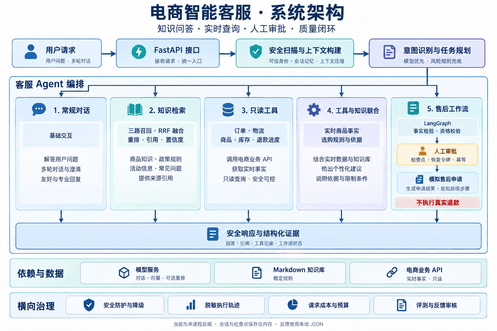

# 🛍️ 电商智能客服 Agent

<div align="center">


**有依据地回答，有边界地执行，可追溯地改进。**

[系统架构](#-系统架构) · [核心特性](#-核心特性) · [快速开始](#-快速开始) · [接口概览](#-接口概览) · [演进记录](CHANGELOG.md)

</div>

---

**电商智能客服 Agent** 是基于 **Python + FastAPI + LangChain + LangGraph** 构建的客服智能体后端，围绕商品咨询、活动规则、订单物流与售后申请等场景，串联知识检索、业务工具、多轮会话和人工审批。

项目将 **Markdown 知识库中的稳定规则** 与 **电商业务接口中的实时事实** 分别管理，再由任务规划器选择常规对话、知识检索、只读工具、工具与知识联合或售后工作流。每轮响应除答案外，还提供引用、工具记录、工作流状态和成本摘要，方便接入客服界面与调试后台。

**当前定位是面向学习与工程验证的单体后端项目。** 仓库持续演进同一套可运行代码，适合研究智能体路由、检索增强生成、工具调用、人工介入和评测反馈闭环。当前版本为 **`v0.35.0`**，不包含客服前端与配套电商业务服务。

## 🏗️ 系统架构



> **架构说明：** 上图展示单个客服后端中的逻辑模块。模型服务提供对话、向量化及可选重排能力；本地知识库提供稳定规则；独立电商业务服务提供实时事实。人工审批通过后仅记录模拟售后申请，不执行真实退款或退货写操作。

| 执行路径 | 适用场景 | 处理方式 |
| :--- | :--- | :--- |
| 常规对话 | 问候、基础交互 | 直接生成回复，避免不必要的检索与工具调用 |
| 知识检索 | 活动规则、运费说明、售后政策 | 检索知识片段、重排并附带引用；证据不足时采用低置信兜底 |
| 只读工具 | 订单状态、物流进度、商品价格与库存、退款进度 | 校验参数和所需身份后，读取电商业务接口 |
| 工具与知识联合 | 同时涉及商品实时信息与选购规则的问题 | 结合实时商品事实与相关知识生成回答 |
| 售后工作流 | 未发货退款、签收后退货 | 核验事实和资格，符合条件后暂停等待人工审批 |

## 🚀 核心特性

- **🧭 模型规划与风险规则协同**
  普通请求优先采用模型生成的路由计划；安全、退款与退货边界由确定性规则约束。返回意图识别和路由证据，便于理解请求为什么进入某条路径。

- **📚 三路混合检索与可追溯引用**
  原始问题向量、改写问题向量和关键词共同召回，通过加权 RRF（倒数排名融合）整合候选，再进行重排与置信度判断。仅将命中的少量知识放入提示词；缓存稳定知识候选，不缓存最终答案或实时业务事实。

- **🔧 受控的业务工具调用**
  使用 LangChain 工具调用衔接订单、物流、商品与退款进度接口。缺少参数时先澄清，身份信息从运行上下文注入，工具结果经过脱敏与压缩后再进入后续处理。

- **🛡️ 可暂停、可恢复的售后审批**
  使用 LangGraph 编排售后流程，以检查点、恢复令牌、冻结字段和幂等机制维护审批边界。恢复时校验审批字段并重新核验业务事实，避免将聊天中的“已审批”声明当作执行凭证。

- **💬 有信任边界的多轮上下文**
  区分可信运行上下文、用户消息、会话记忆与外部文本，支持订单和商品指代消歧、受控记忆写入、滑动窗口与上下文压缩，保留身份及工作流等关键约束。

- **🔍 安全防护与执行可观测**
  覆盖提示词注入检测、外部文本扫描、隐私脱敏、工具钩子与错误降级。公共执行轨迹记录结构化证据，不公开系统提示词、原始工具结果、凭证或隐藏思维链。

- **🔁 人工审核驱动的质量闭环**
  固定用例评测覆盖路由、工具、引用及审批恢复；负反馈经相似用例推荐、人工确认、重跑归因与候选审核后，才可作为批准用例进入后续回归。

- **💰 请求级成本观测**
  按执行路径汇总模型阶段、词元用量、工具调用、检索缓存和上下文压缩信号，提供费用估算与预算告警，帮助比较不同路径的调用开销。

## 🛠️ 技术栈

| 领域 | 技术选型 | 项目中的职责 |
| :--- | :--- | :--- |
| 服务接口 | Python 3.13+、FastAPI、Uvicorn | 对话、审批恢复、执行轨迹及评测反馈接口 |
| 数据契约 | Pydantic | 请求校验与结构化响应 |
| 模型与工具 | LangChain、langchain-openai | 兼容 OpenAI 接口的模型接入与工具调用 |
| 工作流 | LangGraph | 售后状态流转与人工审批前的流程编排 |
| 检索增强 | 向量检索、关键词召回、加权 RRF、重排 | 融合稳定知识证据，提供引用与低置信兜底 |
| 业务集成 | HTTPX | 访问独立电商后端的只读接口 |
| 知识与评测 | Markdown、YAML、JSON | 政策知识、固定用例与能力声明 |
| 状态存储 | 进程内存、本地 JSON | 会话、检查点、索引缓存，以及反馈与审核数据 |
| 验证 | unittest、模拟依赖 | 离线单元测试与集成回归 |

依赖版本以 [requirements.txt](requirements.txt) 为准。默认使用轻量规则重排，外部重排模型需显式开启；当前未引入独立向量数据库。

## 🧩 核心设计难点与解决方案

### 1. 如何避免把稳定规则当成实时业务事实？

**场景：** “这款耳机现在多少钱、适不适合通勤？”同时需要最新商品信息和选购建议。仅查询知识库容易使用过时价格，仅查业务接口又缺少解释依据。

**方案：** 将价格、库存与订单状态交给只读业务工具，将产品指南、活动与售后规则交给知识检索。联合路径汇总两类证据，检索缓存只保存稳定知识候选，防止实时事实被长期复用。

### 2. 如何在不同检索结果之间进行可靠融合？

**场景：** 用户口语、精确活动词和语义相似内容各有不同的召回优势，向量分数与关键词分数也不适合直接相加。

**方案：** 保留原始问题、改写问题与关键词三路结果，按排名进行加权 RRF 融合，并公开路线排名、贡献值和候选顺序。随后结合规则有效期等信号重排；更换融合版本或参数时，缓存键同步变化。

### 3. 如何让高风险售后停在正确的审批边界？

**场景：** 用户要求直接退款，或在聊天中声称“客服已经同意”，都不能替代实际审批。等待审批期间，订单状态也可能发生变化。

**方案：** 工作流先核验订单、物流与售后资格，满足条件后生成待审批状态。审批只能通过 `/chat/resume` 恢复，校验恢复令牌、审批字段与冻结内容，并重新读取业务事实。重复恢复受幂等机制约束，当前终点是进程内模拟申请。

### 4. 如何把一次差评变成可验证的改进？

**场景：** 用户反馈“不准确”，并不直接说明问题出在检索、工具、上下文还是工作流；未经审核的反馈也不应直接成为测试期望。

**方案：** 将反馈绑定公共执行轨迹，推荐相似用例，由人工确认关联用例或新场景。对关联用例重跑评测并归因，再生成候选回归用例，支持批准、拒绝或合并。只有批准的新增用例进入后续评测。

## 📂 项目结构

```text
ecommerce-customer-service-agent/
├── backend/
│   ├── main.py                 # 服务入口
│   ├── agents/                 # 客服智能体主编排
│   ├── api/                    # HTTP 路由与请求、响应契约
│   ├── planner/                # 任务规划与执行路径选择
│   ├── models/                 # 对话、分类与规划模型客户端
│   ├── embeddings/             # 向量模型客户端
│   ├── rag/                    # 改写、混合检索、RRF、重排与引用
│   ├── knowledge/              # 商品、活动、物流与售后知识
│   ├── tools/                  # 工具契约、参数澄清与执行
│   ├── integrations/           # 电商业务接口客户端
│   ├── workflows/              # LangGraph 售后流程
│   ├── policies/               # 售后资格与风险策略
│   ├── approvals/              # 人工审批与恢复协议
│   ├── state/                  # 进程内检查点
│   ├── context/                # 上下文构建、信任边界与压缩
│   ├── memory/                 # 会话记忆与写入策略
│   ├── safety/                 # 注入检测与隐私脱敏
│   ├── hooks/                  # 工具、错误与完成阶段钩子
│   ├── degradation/            # 安全降级与失败兜底
│   ├── observability/          # 公共执行轨迹与工具观察结果
│   ├── mcp_catalog/            # 本地 MCP 风格能力目录
│   ├── evals/                  # 固定用例与审批恢复评测
│   ├── feedback/               # 相似用例推荐、归因与审核存储
│   ├── cost/                   # 请求成本与预算治理
│   ├── config/                 # 配置加载与默认参数
│   ├── agent_capabilities.json # 当前版本能力声明
│   ├── cases.yml               # 固定回归用例
│   └── rag_quality_cases.json  # 检索质量用例
├── tests/                      # 离线单元与集成测试
├── readmeImg/                  # README 架构图
├── .env.example                # 环境变量示例
├── requirements.txt            # 锁定的依赖版本
├── CHANGELOG.md                # 版本演进记录
└── README.md
```

## ⚡ 快速开始

### 1. 准备运行环境

- **Python 3.13+** 与 Git。以下命令使用 Windows PowerShell，在仓库根目录执行。
- **模型服务：** 需支持对话与向量接口；工具路径还需要模型支持工具调用。
- **电商业务服务：** 实时查询及售后事实核验依赖独立服务，接口契约见 [电商客户端](backend/integrations/ecommerce_client.py)。仅运行本仓库不会自动启动该服务。

```powershell
git clone https://github.com/Dong030928/ecommerce-customer-service-agent.git
Set-Location ecommerce-customer-service-agent
py -3.13 -m venv .venv
.\.venv\Scripts\python.exe -m pip install -r requirements.txt
Copy-Item .env.example .env
```

已有本地仓库时跳过克隆；已有 `.env` 时直接编辑，保留现有配置。

### 2. 配置模型与业务连接

编辑仓库根目录的 `.env`，替换占位值。以下模型名称和地址沿用仓库示例，请按实际服务提供的模型填写。

```dotenv
AGENT_OPENAI_API_KEY=your-api-key
AGENT_OPENAI_BASE_URL=https://api.siliconflow.cn/v1
AGENT_OPENAI_MODEL=Qwen/Qwen3-8B
AGENT_CLASSIFIER_MODEL=Qwen/Qwen3-8B
AGENT_EMBEDDING_MODEL=Qwen/Qwen3-Embedding-4B

AGENT_ECOMMERCE_BASE_URL=http://127.0.0.1:8081
AGENT_ECOMMERCE_SERVICE_TOKEN=replace-me
```

对话与向量客户端共用 `AGENT_OPENAI_API_KEY` 和 `AGENT_OPENAI_BASE_URL`。订单、物流与退款进度查询携带服务令牌及可信用户身份，由电商后端核验访问权限。

| 可选配置 | 示例值 | 说明 |
| :--- | :--- | :--- |
| `AGENT_RAG_RERANK_ENABLED` | `0` | 设为 `1` 才尝试外部重排；同时配置对应的 `AGENT_RAG_RERANK_*` 参数 |
| `AGENT_FEEDBACK_STORE_PATH` | `.runtime/feedback_store.json` | 反馈与审核数据文件；建议按部署位置设置绝对路径 |
| `AGENT_REQUEST_TOKEN_BUDGET` | `1000` | 请求词元预算告警阈值，不代表超限自动停止执行 |
| `AGENT_INPUT_CNY_PER_1K` | `0.001` | 每千输入词元的人民币估算单价 |
| `AGENT_OUTPUT_CNY_PER_1K` | `0.002` | 每千输出词元的人民币估算单价 |

常用环境变量见 [.env.example](.env.example)，其余检索与上下文参数见 [配置模块](backend/config/settings.py)。费用单价是可调整的示例值；`.env` 已加入忽略规则，不要提交真实密钥和令牌。

### 3. 启动服务

```powershell
Set-Location backend
..\.venv\Scripts\python.exe main.py
```

| 入口 | 地址 |
| :--- | :--- |
| 健康检查与知识索引摘要 | <http://localhost:8000/health> |
| 交互式接口文档 | <http://localhost:8000/docs> |
| 当前版本与能力清单 | <http://localhost:8000/capabilities> |

健康检查读取本地知识索引，不调用模型服务；它不能代表模型与业务接口已连通。首次向量检索需要调用向量服务，初始化耗时可能高于后续请求。

### 4. 发起一轮对话

在另一个 PowerShell 窗口执行：

```powershell
$body = @{
    session_id = "demo-session-001"
    runtime_user_id = "U1001"
    runtime_nickname = "张三"
    runtime_member_level = "gold"
    runtime_risk_level = "low"
    user_message = "查询订单 A20250001 的物流进度"
} | ConvertTo-Json -Depth 5

$response = Invoke-RestMethod `
    -Method Post `
    -Uri "http://localhost:8000/chat" `
    -ContentType "application/json; charset=utf-8" `
    -Body ([System.Text.Encoding]::UTF8.GetBytes($body))

$response | ConvertTo-Json -Depth 20
```

示例用户与订单是演示占位值，请替换成配套业务服务中的有效数据。`runtime_*` 字段应由完成身份认证的可信服务端填写，不能直接信任终端用户提交的身份或会员等级；本项目当前尚未实现该认证层。

响应中的 `answer` 为用户可读答案，`intent_result`、`route_plan`、`tool_calls`、`citations`、`workflow`、`approval`、`safety_decision` 和 `cost_summary` 提供对应路径的结构化结果，部分字段可能为空。

## 🔌 接口概览

| 方法 | 路径 | 用途 |
| :--- | :--- | :--- |
| `GET` | `/health` | 健康状态、版本与知识索引摘要 |
| `GET` | `/capabilities` | 能力声明与尚未实现能力的说明 |
| `POST` | `/chat` | 发起一轮对话 |
| `POST` | `/chat/resume` | 提交人工审批决定并恢复售后流程 |
| `GET` | `/sessions/{session_id}/trace` | 查询会话的脱敏执行轨迹 |
| `POST` | `/eval/run` | 运行全部固定用例与已批准用例，或指定单个用例 |
| `GET` | `/eval/cases` | 查询可用于反馈匹配的评测用例 |
| `POST` | `/feedback/submit` | 提交反馈并推荐相似用例 |
| `GET` | `/feedback` | 查询反馈审核队列，可按状态过滤 |
| `GET` | `/feedback/{feedback_id}` | 查询反馈详情 |
| `POST` | `/feedback/{feedback_id}/case-confirm` | 人工确认关联用例或新场景，并触发后续归因 |
| `POST` | `/feedback/{feedback_id}/review` | 批准、拒绝或合并候选回归用例 |

审批恢复需要 `session_id`、`workflow_id`、`resume_token`、`reviewer_id`、`reviewer_role` 与 `decision`，应使用实际待审批响应中的标识和令牌。完整字段及可选值见 [数据契约](backend/api/schemas.py) 或运行后的 [接口文档](http://localhost:8000/docs)。

## 🧪 测试与评测

### 离线回归

安装依赖后，在仓库根目录运行，无需真实模型密钥：

```powershell
.\.venv\Scripts\python.exe -m unittest discover -s tests -v
```

测试覆盖混合检索与 RRF、工具参数与观察结果、售后审批恢复、上下文与记忆、安全与降级、执行轨迹、反馈审核及成本治理。

### 运行时评测

启动服务后，可通过接口运行固定用例与已批准的回填用例：

```powershell
Invoke-RestMethod `
    -Method Post `
    -Uri "http://localhost:8000/eval/run" `
    -ContentType "application/json" `
    -Body '{}'
```

也可在请求体中传入 `case_id` 运行单个用例。运行时评测使用当前模型、向量和业务接口配置，需要与用例匹配的业务数据，并可能产生调用费用；结果依据固定断言判定，当前未使用模型裁判。

## 📌 当前边界

| 方面 | 当前实现与限制 |
| :--- | :--- |
| 业务写入 | 电商工具均为只读；审批后只生成进程内模拟售后申请，不调用真实退款、支付或订单写接口 |
| 身份与权限 | 校验运行身份和审批角色等字段，但未接入独立认证与 RBAC；对话、审批、执行轨迹、管理及评测接口需要可信接入层保护 |
| 状态持久化 | 会话、检查点、执行轨迹、索引及缓存主要在进程内，服务重启后不能恢复审批检查点；反馈及其轨迹快照、候选与已批准用例保存在本地 JSON |
| 多实例部署 | 本地状态和文件存储不提供跨实例一致性，扩展前需补充共享状态与事务存储 |
| MCP 集成 | 当前为本地 MCP 风格能力目录，尚未连接独立远程 MCP 服务 |
| 成本统计 | 提供请求级估算与告警，不等同于平台账单，未覆盖向量、重排及业务接口的全部费用 |
| 部署就绪度 | 当前适合本地学习与联调，公开部署前需完善认证、权限、限流、审计和持久化 |

## 📝 演进记录

项目保持单一工程目录持续演进，通过版本记录和 Git 提交追踪每次改动。近期版本重点：

| 版本 | 演进重点 |
| :--- | :--- |
| `v0.35.0` | 三路加权 RRF、普通请求模型优先路由、人工审批恢复评测 |
| `v0.34.0` | 按请求路径细分的成本观测与预算告警 |
| `v0.33.0` | 负反馈相似用例推荐、人工审核与本地持久化 |

完整记录见 [CHANGELOG.md](CHANGELOG.md)。

## 🤝 交流与贡献

欢迎围绕电商客服场景、知识质量、工具契约、审批流程和可观测性提出改进。提交问题时可提供脱敏后的复现步骤、预期行为与执行轨迹；提交代码时请同步相关测试和文档。

- **作者：** [Dong030928](https://github.com/Dong030928)
- **问题与建议：** [GitHub Issues](https://github.com/Dong030928/ecommerce-customer-service-agent/issues)

---

如果这个项目对你理解智能体工程有帮助，欢迎点亮一颗 ⭐。
