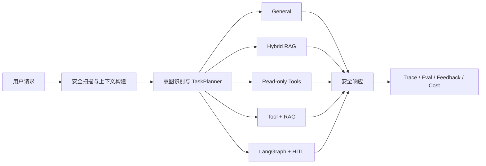

# E-commerce Customer Service Agent

面向电商客服场景的 AI Agent 后端。项目以单一可运行仓库持续演进，覆盖知识问答、实时业务查询、高风险售后审批、多轮会话、安全治理、可观测性与评测反馈闭环。

当前版本：`v0.35.0`

## 核心能力

| 能力 | 实现 |
| --- | --- |
| 智能路由 | 普通请求模型优先，安全/退款边界规则兜底，在 General、RAG、Tool、Tool + RAG、Workflow 间选择路径 |
| 知识问答 | OpenAI-compatible Embedding、三路 RRF 融合、Reranker、引用与低置信兜底 |
| 实时查询 | LangChain Tool Calling 对接订单、物流、商品、库存和退款进度等只读接口 |
| 高风险售后 | LangGraph 编排退款/退货流程，通过 checkpoint、恢复令牌和幂等键实现 HITL |
| 多轮上下文 | Session Memory、可信 Runtime Context、上下文压缩与订单/商品指代消歧 |
| 安全与可观测 | Prompt Injection 防护、隐私脱敏、公共 Trace、错误分类与安全降级 |
| 质量闭环 | 固定用例与 HITL 恢复评测、负反馈向量匹配、失败归因、人工审核后回填回归用例 |
| 成本治理 | 按请求路径汇总模型阶段、token、工具/RAG 使用情况、预算告警与成本估算 |

## 工作方式



稳定规则来自仓库内 Markdown 知识库；订单状态、物流进度、价格与库存等实时事实只来自电商业务 API。退款、退货、取消和赔付等写操作不会由模型直接执行，而是在确定性校验后停在人工审批边界。

## 快速开始

要求 Python 3.13+，并准备一个 OpenAI-compatible 模型服务。实时查询还需要启动配套电商后端。

```powershell
py -3.13 -m venv .venv
.venv\Scripts\python -m pip install -r requirements.txt
Copy-Item .env.example .env
```

在 `.env` 中至少配置：

```dotenv
AGENT_OPENAI_API_KEY=your-api-key
AGENT_OPENAI_BASE_URL=https://api.siliconflow.cn/v1
AGENT_OPENAI_MODEL=Qwen/Qwen3-8B
AGENT_EMBEDDING_MODEL=Qwen/Qwen3-Embedding-4B

AGENT_ECOMMERCE_BASE_URL=http://127.0.0.1:8081
AGENT_ECOMMERCE_SERVICE_TOKEN=replace-me
```

完整配置及默认值见 `.env.example`。不要提交真实 Key 或服务令牌。

启动服务：

```powershell
Set-Location backend
..\.venv\Scripts\python main.py
```

- 健康检查：`http://localhost:8000/health`
- Swagger 文档：`http://localhost:8000/docs`
- 能力清单：`http://localhost:8000/capabilities`

## 调用示例

```powershell
$body = @{
  session_id = "demo-session-001"
  runtime_user_id = "U1001"
  runtime_nickname = "张三"
  runtime_member_level = "gold"
  runtime_risk_level = "low"
  user_message = "查询订单 A20250001 的物流进度"
} | ConvertTo-Json

Invoke-RestMethod `
  -Method Post `
  -Uri http://localhost:8000/chat `
  -ContentType "application/json" `
  -Body $body
```

响应除自然语言答案外，还会按实际路径返回 `intent_result`、`route_plan`、`tool_calls`、`citations`、`workflow`、`safety_decision`、`cost_summary` 等结构化证据。

## API 概览

| 方法 | 路径 | 用途 |
| --- | --- | --- |
| `GET` | `/health` | 健康状态与知识索引摘要 |
| `GET` | `/capabilities` | 当前版本及能力声明 |
| `POST` | `/chat` | 发起一轮对话 |
| `POST` | `/chat/resume` | 提交人工审批决定并恢复工作流 |
| `GET` | `/sessions/{session_id}/trace` | 查询脱敏后的公共执行轨迹 |
| `POST` | `/eval/run` | 运行全部或指定固定评测用例 |
| `GET` | `/eval/cases` | 查询可用于反馈匹配的用例 |
| `POST` | `/feedback/submit` | 提交反馈并推荐相似用例 |
| `GET` | `/feedback` | 查询反馈审核队列 |
| `GET` | `/feedback/{feedback_id}` | 查询反馈详情 |
| `POST` | `/feedback/{feedback_id}/case-confirm` | 人工确认关联用例并触发重跑归因 |
| `POST` | `/feedback/{feedback_id}/review` | 批准、拒绝或合并候选回归用例 |

请求与响应的完整 Schema 以 Swagger 文档为准。

## 项目结构

```text
backend/
  agents/         Agent 主编排
  api/            FastAPI 路由与数据契约
  context/        Runtime Context、压缩与上下文选择
  rag/            索引、混合检索、重排与质量评估
  tools/          工具契约、参数澄清与可信执行
  workflows/      LangGraph 售后工作流
  safety/         注入检测与隐私脱敏
  observability/  公共 Trace
  evals/          固定用例评测
  feedback/       反馈归因与用例回填
  cost/           Token 与请求级成本治理
  knowledge/      可追溯 Markdown 知识库
  cases.yml       固定回归用例
tests/            离线单元与集成测试
```

## 验证

无需真实模型 Key 即可运行离线回归：

```powershell
python -m unittest discover -s tests -v
```

运行中的服务也可通过 `POST /eval/run` 执行端到端固定用例；该方式会使用当前模型、Embedding 与业务 API 配置，并可能产生调用费用。

## 当前边界

- 电商工具均为只读；HITL 只生成模拟售后申请，不调用真实退款、支付或订单写接口。
- 索引、缓存、会话记忆、checkpoint 与 Trace 主要保存在进程内；反馈默认使用本地 JSON，不支持多实例事务。
- MCP 部分是本地 MCP-style Catalog，尚未连接独立远程 MCP Server。
- 公共 Trace 只记录脱敏后的执行证据，不暴露系统提示词、原始工具结果、凭证或隐藏思维链。
- 成本摘要用于工程观测，不等同于模型平台账单；当前未汇总 Embedding、Reranker 和业务 API 的全部费用。
- 管理与评测接口尚无独立鉴权，公开部署前需要补充认证、RBAC、限流、审计和持久化基础设施。
